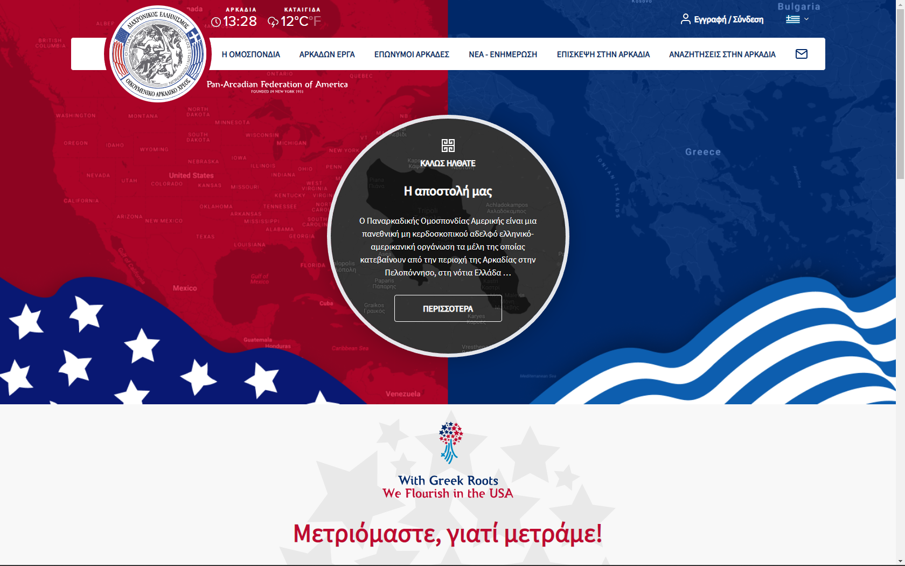
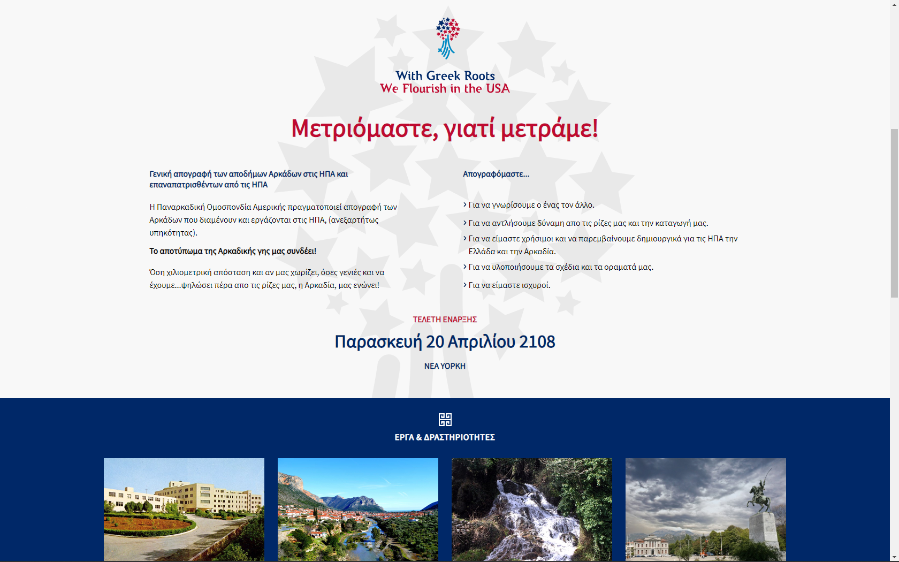

# Responsive Website with Tailwindcss

_Some screenshots_




📌 This website project was part of preparation process as requested from a job I was applied. So they gave me the design files and my goal was to make a copy of the design using html and tailwindcss

#### <u>Strong points</u>

- responsive web design
- responsive navbar with mobile navbar

## 😎 Watch live

[](https://6356b51bbf27495eb0f7cb8f--superb-starlight-f8685a.netlify.app/)

## 🏠 Run Locally

Clone the project

```bash
  git clone https://github.com/K1riakos/responsive-website-tailwindcss
```

Go to the project directory

```bash
  cd netflix-landing-clone
```

<br>

## ⚙️ Used

<br>

**👉 Coding**


<br>

**🖥️ Editor**


<br>

**🛠️ Version Control**


<br>

## 🙋🏻‍♂️ Author

**Kyriakos Kiri Sidiropoulos**
